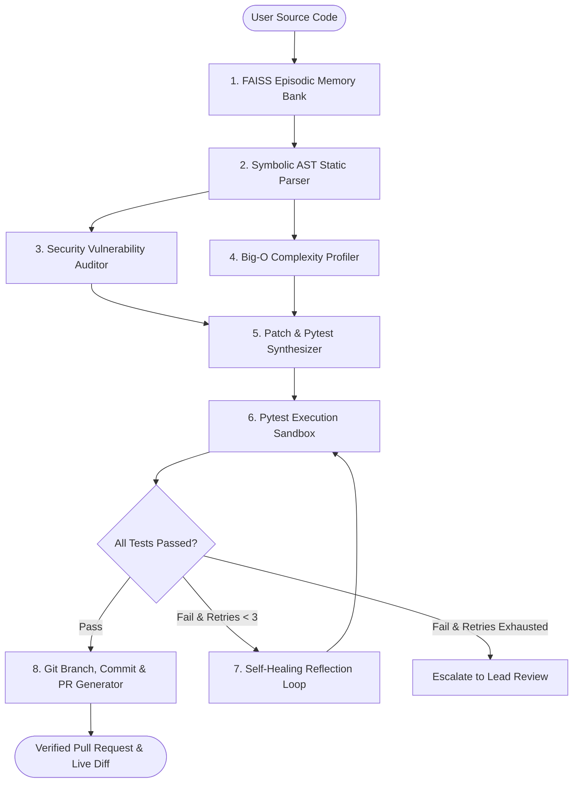

# 🛡️ CogniCode Engine
> **Autonomous Multi-Agent Code Remediation & Test-Driven Self-Healing Engine**  
> *Built with LangGraph, Python AST, FAISS Episodic Memory, Pytest Sandbox, and GitHub Automation.*

---

## 🌟 Overview
**CogniCode** is an enterprise-grade agentic platform designed to automate the software debugging, vulnerability remediation, and pull-request workflow. Unlike static linters or simple autocomplete LLMs, CogniCode employs a **Neuro-Symbolic cyclic multi-agent architecture** that:
1. Deterministically audits code structure via **Python AST**.
2. Leverages an **Episodic Memory Bank (FAISS)** of enterprise CWE/OWASP remediation patterns.
3. Deploys specialized **Security** and **Big-O Algorithmic Profiling** agents.
4. Synthesizes refactored code and an edge-case **Pytest test suite**.
5. Executes the tests in an **isolated execution sandbox**.
6. Autonomously **self-heals in a cyclic loop** if tests fail by analyzing compiler error tracebacks.
7. Automates **Git branching, commits, and GitHub Pull Request creation**.

---

## 🏛️ Architecture Workflow



---

## 🚀 Quick Start Guide

### 1. Clone & Setup Virtual Environment
```bash
git clone https://github.com/Sapair-og/cognicode-engine.git
cd cognicode-engine

# Initialize Python 3.11 virtual environment
python -m venv .venv

# Activate on Windows (PowerShell)
.venv\Scripts\Activate.ps1
```

### 2. Install Dependencies
```bash
pip install -r requirements.txt
```

### 3. Configure API Keys
Copy `.env.example` to `.env` and fill in your keys:
```bash
cp .env.example .env
```
*(You can also input your keys directly inside the Streamlit UI sidebar!)*

### 4. Launch the Interactive Dashboard
```bash
streamlit run app.py
```

---

## 📁 Repository Structure
```
cognicode-engine/
├── app.py                         # Streamlit interactive UI & live graph visualizer
├── requirements.txt               # Pinned dependencies
├── .env.example                   # Environment configuration template
├── STUDY_AND_INTERVIEW_GUIDE.md   # Master 1-Day study guide & 25 Infosys interview Q&As
├── src/
│   ├── state.py                   # TypedDict AgentState schema (Single Source of Truth)
│   ├── config.py                  # LLM provider loader (OpenAI / Groq)
│   ├── ast_analyzer.py            # Symbolic AST parser & cyclomatic complexity
│   ├── memory.py                  # FAISS Episodic Memory Bank (CWE/OWASP patterns)
│   ├── sandbox.py                 # Isolated Pytest execution runner with timeouts
│   ├── git_manager.py             # Git diff, commit, and GitHub PR API integration
│   ├── chains.py                  # Pydantic schemas & prompt templates
│   ├── nodes.py                   # Specialized agent node functions
│   └── graph.py                   # LangGraph StateGraph assembly & conditional routing
└── samples/
    ├── sql_injection.py           # CWE-89 SQL Injection sample
    ├── exponential_fibonacci.py   # CWE-400 O(2^N) recursion bottleneck sample
    └── null_dereference.py        # CWE-476 NoneType crash sample
```

---

## 📄 License
MIT License. Developed by Yashvardhan Singh Sarangdevot.
